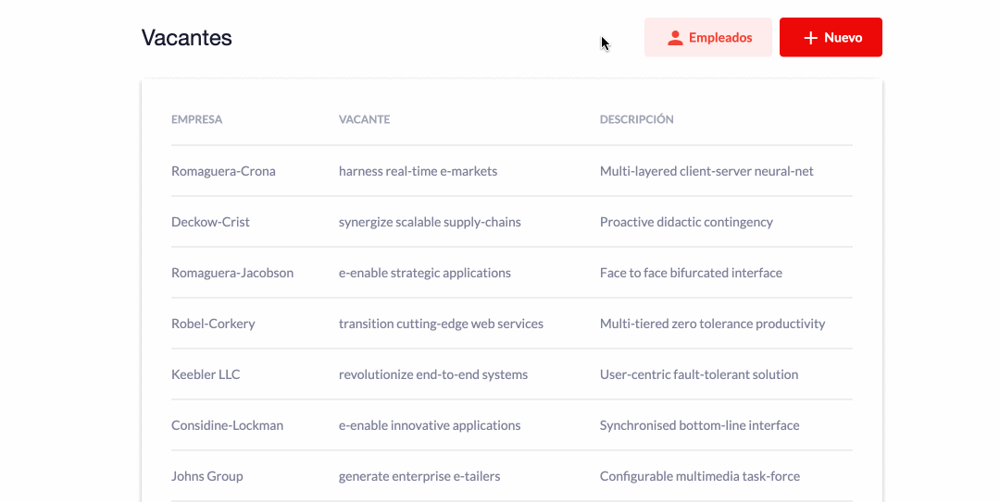

# Dynamic Section

Ejemplo de un componente plantilla el cual sirve para crear una estructura general de alguna sección y tener homologado el mismo estilo. Dejando que todo el contenido sea dinámico.

<div>
  
</div>

section.component.html
```html
<section>
  <header>
    <h2>{{sectionTitle}}</h2>
    <ng-container [ngTemplateOutlet]="customHeader ? customHeader : defaultHeader"></ng-container>
  </header>
  <div class="content">
    <ng-content></ng-content>
  </div>
  <footer>
    <ng-container [ngTemplateOutlet]="customFooter ? customFooter : defaultFooter"></ng-container>
  </footer>
</section>

<ng-template #defaultHeader>
  <!-- Mostrar botones para gregar o filtrar -->
</ng-template>

<ng-template #defaultFooter>
  <!-- Mostrar una paginación por defecto -->
</ng-template>
```

section.component.ts
```js
import {Component, Input, TemplateRef} from '@angular/core';

@Component({
  selector: 'app-section',
  templateUrl: './section.component.html',
  styleUrls: ['./section.component.scss']
})
export class SectionComponent {
  @Input() sectionTitle = '';
  @Input() customHeader!: TemplateRef<any>;
  @Input() customFooter!: TemplateRef<any>;
}
```

### Uso

jobs.component.html
```html
<app-section sectionTitle="Vacantes">
  <!-- tabla de vacantes -->
</app-section>
```

employees.component.html
```html
<app-section sectionTitle="Empleados" [customHeader]="searchBar">
  <!-- tabla de empleados -->
</app-section>

<!-- Cambiar la cabecera que trae botones por defecto y agregar una barra de busqueda -->
<ng-template #searchBar>
  <input type="text" placeholder="Buscar empleado...">
</ng-template>
```