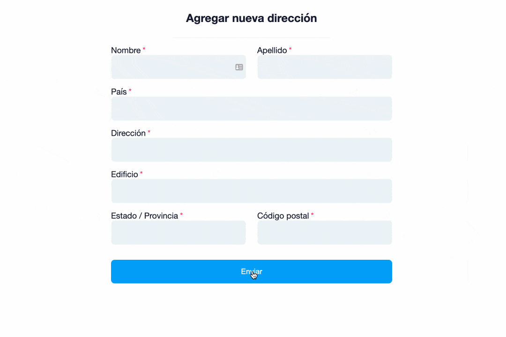

# Field Errors

Componente para mostrar errores de inputs de formularios reactivos.

<div>
  
</div>


field-errors.component.html
```html
<ng-container *ngIf="error">
  {{ error }}
</ng-container>
```

field-errors.component.ts
```js
import {Component, Host, Input, Optional} from '@angular/core';
import {FormGroupDirective} from '@angular/forms';
import {ERROR_MESSAGES} from './constants';

@Component({
  selector: 'app-field-errors',
  templateUrl: './field-errors.component.html',
  styleUrls: ['./field-errors.component.scss'],
})
export class FieldErrorsComponent {
  @Input() field!: string;
  form: FormGroupDirective;

  constructor(@Optional() @Host() private reactiveForm: FormGroupDirective) {
    this.form = this.reactiveForm;

    if (!this.form) {
      throw new Error('control-errors must be used with a parent formGroup directive');
    }
  }

  get error(): string | null {
    const control = this.form.form.controls[this.field];
    let firstError = null;

    if (control && this.form.submitted) {
      Object.keys(ERROR_MESSAGES).some(error => {
        if (control.hasError(error)) {
          firstError = ERROR_MESSAGES[error];
          return true;
        }
        return false;
      });
    }
    return firstError;
  }
}
```

constants.ts
```js
// El objetivo de este archivo es tener todos los 
// mensajes de error de forma centralizada.

// Otro enfoque sería utilizar inyección de depencias para este archivo.

export const ERROR_MESSAGES: Record<string, string> = {
  required: 'El campo es requerido',
  invalidEmail: 'El correo es inválido',
  invalidCredentials: 'El correo y/o la contraseña son incorrectos',
};
```

### Uso

```html
<input type="text" formControlName="name" />
<app-field-errors field="name"></app-field-errors>
<!-- solo se necesita pasar el formControlName a la propiedad field -->
```

Sin el componente
```html
<input type="text" formControlName="name" />
<span *ngIf="form.get('name')?.errors?.['required'] && form.get('name')?.touched">El campo es requerido</span>
<!-- definir cada error... -->
```